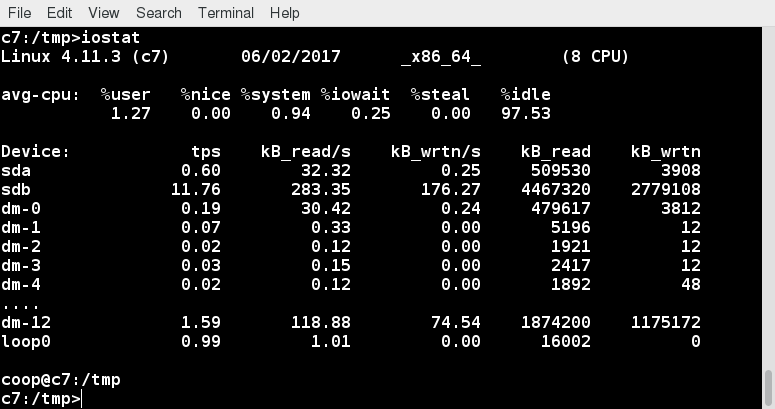
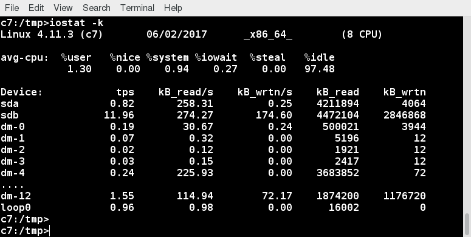
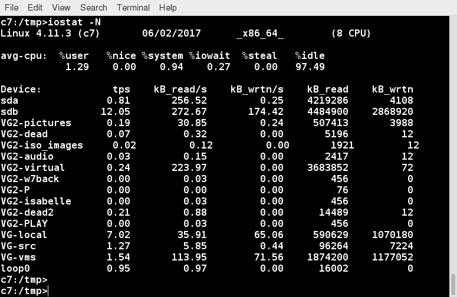
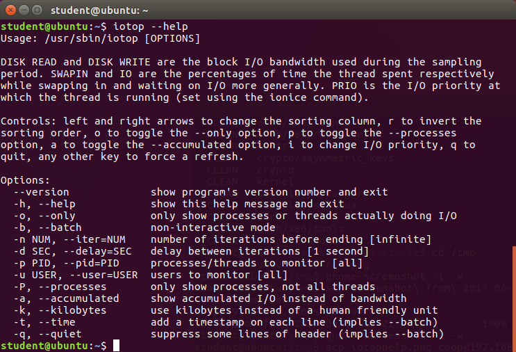

[Previous Chapter](../Ch13-memory/notes_Ch13.md) - [Table of Contents](../README.md#table-of-contents) - [Next Chapter](../Ch15-schedulingio/notes_Ch15.md)

---

# Chapter 14 I/O Monitoring and Tuning - Notes

## 14.3 Learning Objectives:
- Understand the importance of monitoring I/O activity and when it constitutes system performance bottlenecks.
- Use **iostat** to monitor system I/O device activity.
- Use **iotop** to display a constantly updated table of current I/O usage.
- Use **ionice** to set both the **I/O scheduling class** and the **priority** for a given process.


## 14.4 I/O Monitoring and Disk Bottlenecks
Disk performance problems -> strongly coupled to other factors, eg. insufficient memory, inadequate network hardware/tuning. Disentanglement difficult.

Rule: system considered as **I/O-bound** when CPU found sitting idle waiting for I/O to complete, or network waiting to clear buffers.

However, can be misled. What appears to be insufficient memory can result from too slow I/O. If memory buffers being used for reading/writing fill up, may appear that memory is problem, when real problem is that buffers are not filling up or emptying out fast enough. Similarly, network transfers may be waiting for I/O to complete, causing network throughput to suffer.

Real-time monitoring + tracing -> both necessary tools for locating/mitigating disk bottlenecks. However, rare/non-repeating problems can make this difficult to accomplish.

Many relevant variables, I/O tuning complex. Will also consider **I/O scheduling** later.


## 14.5 iostat
**iostat**: basic workhorse utility for monitoring I/O device activity on system. Can generate reports with lot of information, with precise content controlled by options.

Can see below what simply typing **iostat** shows:



After brief summary of CPU utilization, I/O statistics given: **tps** (I/O transactions per second; logical requests can be **merged** into one actual request), clocks read/written per unit time, where blocks are generally sectors of 512 bytes; total blocks read/written.

Information broken out by disk partition (and if LVM is being used also by **dm**, or device mapper, logical partitions).


## 14.6 iostat Options
Somewhat different display generated by giving **`-k`** option, results in showing KB instead of blocks. Can also use **`-m`** to get results in MB.
```shell
$ iostat -k
```


Another useful option: **`-N`**, to show device name (or **`-d`** for somewhat different format), as shown below:
```shell
$ iostat -N
```


## 14.7 iostat Extended Options
Much more detailed report obtained by using **`-x`** option (for extended).
```shell
$ iostat -xk
```


Fields seen above have following meanings:

**Extended iostat Fields**

Field | Meaning
----- | -------
Device | Device or partition name
rrqm/s | Number of read requests merged per second, queued to device
wrqm/s | Number of write requests merged per second, queued to device
r/s | number of read requests per second, issued to device
w/s | number of write requests per second, issued to device
rkB/s | KB read from the device per second
wkB/s | KB written to the device per second
avgrq-sz | Average request size in 512 byte sectors per second
avgqu-sz | Average queue length of requests issued to the device
await | Average time (in msecs) I/O requests between when a request is issued and when it is completed: queue time plus service time
svctm | Average service time (in msecs) for I/O requests
%util | Percentage of CPU time during the device serviced requests

Note: if utilization percentages approaches 100, system saturated, or I/O bound.

## 14.8 iotop
**iotop** -> another very useful utility, must be run as root. Displays table of current I/O usage, updated periodically, like **top**. Can see below what typing **`sudo iotop`** with no options shows.

Note: **`be`** and **`rt`** entries in **`PRIO`** field explained in **ionice** section, stand for **best effort** and **real time**.


Available options shown by using **`--help`** option.
```shell
$ iotop --help
```
Using **`-o`** option can be useful to avoid clutter.




## 14.9 Using ionice to Set I/O Priorities
**ionice** utility sets both I/O **scheduling class** and **priority** for given process. Takes the form:
```shell
$ ionice [-c class] [-n priority] [-p pid] [COMMAND [ARGS] ]
```
If **pid** given with **`-p`** argument results apply to requested process, otherwise it is process that will be started by **`COMMAND`** with possible arguments. If no arguments given, **ionice** returns scheduling class and priority of current shell process:
```shell
$ ionice
idle: prio 7
```
**`-c`** parameter specifies I/O scheduling class, which can have following 3 values:

**I/O Scheduling Class**

I/O Scheduling Class | **`-c`** value | Meaning
-------------------- | -------------- | -------
None or Unknown | 0 | Default value
Real Time | 1 | Get first access to disk, can starve other processes. Priority defines how big a time slice each process gets
Best Effort | 2 | All programs serviced in round-robin fashion, according to priority settings. The Default
Idle | 3 | No access to disk I/O unless no other program has asked for it for a defined period

**Best Effort** and **Real Time** classes take **`-n`** argument which gives **priority**, which can range from 0 to 7, with 0 being highest priority:
```shell
$ ionice -c 2 -n 3 -p 30078
```

**Note**: **ionice** works only when using **CFQ** I/O Scheduler (will talk about in next chapter).


##

[Back to top](#)

---

[Previous Chapter](../Ch13-memory/notes_Ch13.md) - [Table of Contents](../README.md#table-of-contents) - [Next Chapter](../Ch15-schedulingio/notes_Ch15.md)
