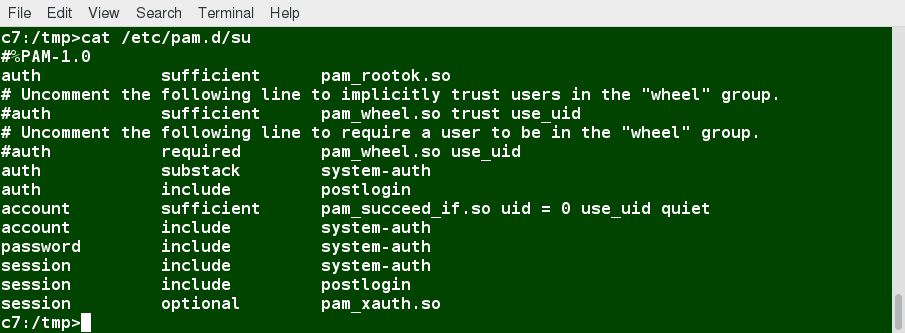

[Previous Chapter](../Ch32-fpo/notes_Ch32.md) - [Table of Contents](../README.md#table-of-contents) - [Next Chapter](../Ch34-networkaddresses/notes_Ch34.md)

---

# Chapter 33 Pluggable Authentication Modules (PAM) - Notes

## 33.2 Introduction
**Pluggable Authentication Modules** provide uniform mechanism to ensure that users and applications properly identified and authenticated. Conditional rules can be applied to limit scope of permissions and control can be established over what to do in case of either success or failure. PAM can also work with LDAP to centralize authentication throughout network.

## 33.3 Learning Objectives:
- Explain the basic concepts that motivate the user of PAM.
- List the steps involved in the authentication process.
- Use and modify PAM configuration files.
- Know how to interpret PAM rules and create new ones.
- Apply LDAP to use and administer distributed directory services over the network.


## 33.4 PAM: A Unified Approach to Authentication
Historically, authentication of users performed individually by individual applications; i.e., **su**, **login**, **ssh** would authenticate and establish user accounts independently of each other.

Most modern Linux applications have been written/rewritten to exploit PAM (<strong>P</strong>luggable <strong>A</strong>uthentication <strong>M</strong>odules) so that authentication can be done in one uniform way, using **libpam**.

This library of modules provides enormous flexibility and consistency with respect to authentication, password, session, account services.

PAM incorporates following components:
- PAM-aware applications
- Configuration files in `/etc/pam.d`
- PAM modules in the **`libpam*`** libraries, which can be found in different locations depending on the Linux distribution

Each PAM-aware application/service may be configured with respect to PAM by individual configuration file in `/etc/pam.d`.


## 33.5 Authentication Process
Several steps involved in authentication:
- User invokes PAM-aware application, such as **login**, **su**, **ssh**
- Application calls **libpam**
- Library checks for files in `/etc/pam.d`; these delineate which PAM modules to invoke, including **system-auth**
- Each referenced module executed in accordance with rules of relevant configuration file for that application


## 33.6 PAM Configuration Files
Each file in `/etc/pam.d` corresponds to a **service** and each (non-commented) line in the file specifies a rule. The rule is formatted as list of space-separated tokens, the first two of which are case insensitive:
```shell
type control module-path module-arguments
```
Example: screenshot here shows contents of `/etc/pam.d/su` on RHEL 7 system. Notice that there is a stack; **su** will require loading of **system-auth** etc.




## 33.7 PAM Rules
Module **`type`** specifies **management group** that module is to be associated with:
- **`auth`**: Instructs application to prompt user for identification (username, password, etc). May set credentials and grant privileges
- **`account`**: Checks on aspects of user's account, such as password aging, access control, etc.
- **`password`**: Responsible for updating user authentication token, usually a password
- **`session`**: Used to provide functions before/after session is established (such as setting up environment, logging, etc)

The **`control`** flag controls how the success/failure of module affects overall authentication process:
- **`required`**: Must return success for the service to be granted. If part of stack, all other modules are still executed. Application not told which module/modules failed
- **`requisite`**: Same as **`required`**, except failure in any module terminates stack and return status sent to application
- **`optional`**: Module not required. If the only module, then return status to application may cause failure
- **`sufficient`**: If this module succeeds, then no subsequent modules in stack executed. If it fails, then it doesn't necessarily cause the stack to fail, unless it is the only one in the stack

There are other **`control`** flags, such as **`include`**, **`substack`**. See **man pam.d** for details.

**`module-path`** gives file name of library to be found in `/lib*/security`, in either absolute or relative path form.

**`module-arguments`** can be given to modify **PAM** module's behavior.


## 33.8 LDAP Authentication
**LDAP** (<strong>L</strong>ightweight <strong>D</strong>irectory <strong>A</strong>ccess <strong>P</strong>rotocol): industry standard protocol for using/administering distributed directory services over network, meant to be both open and vendor-neutral.

When using LDAP for centralized authentication, each system/client connects to centralized LDAP server for user authentication. Using TLS makes it a secure option and is recommended.

LDAP uses PAM and **system-config-authentication** or **authconfig-tui**. One has to specify the server, search base DN (domain name), and TLS (<strong>T</strong>ransport <strong>L</strong>ayer <strong>S</strong>ecurity). Also required: **openldap-clients**, **pam ldap**, **nss-pam-ldapd**.

When configuring system for LDAP authentication, five files changed:
- `/etc/openldap/ldap.conf`
- `/etc/pam_ldap.conf`
- `/etc/nslcd.conf`
- `/etc/sssd/sssd.conf`
- `/etc/nsswitch.conf`

Can edit these files manually or use one of the utility programs available (**system-config-authentication** or **authconfig-tui**).


##

[Back to top](#)

---

[Previous Chapter](../Ch32-fpo/notes_Ch32.md) - [Table of Contents](../README.md#table-of-contents) - [Next Chapter](../Ch34-networkaddresses/notes_Ch34.md)
